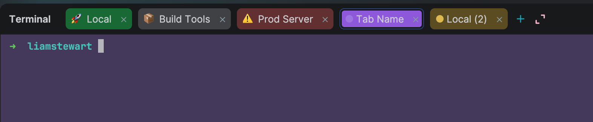
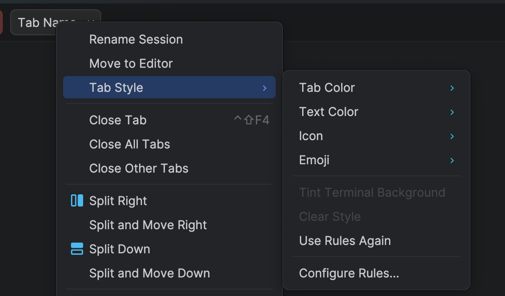
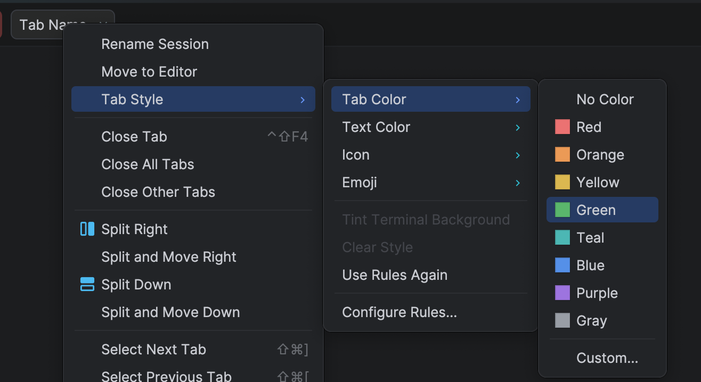
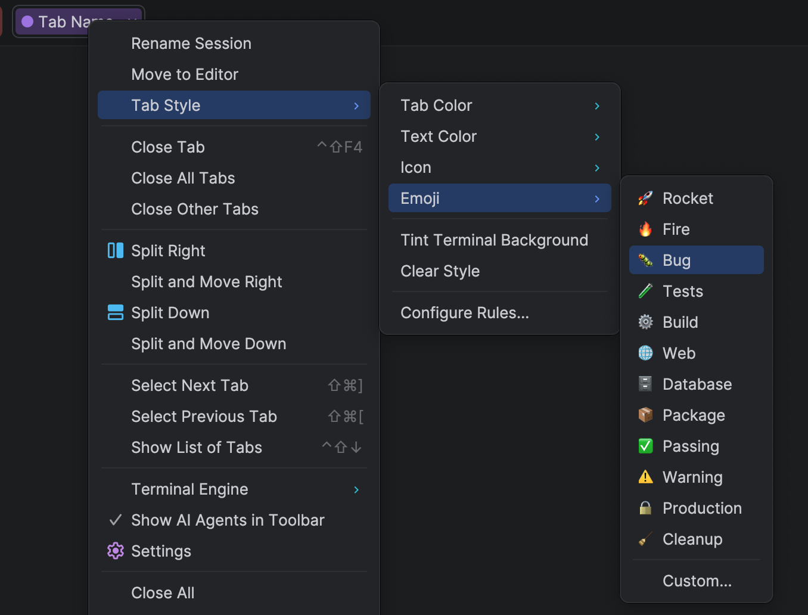
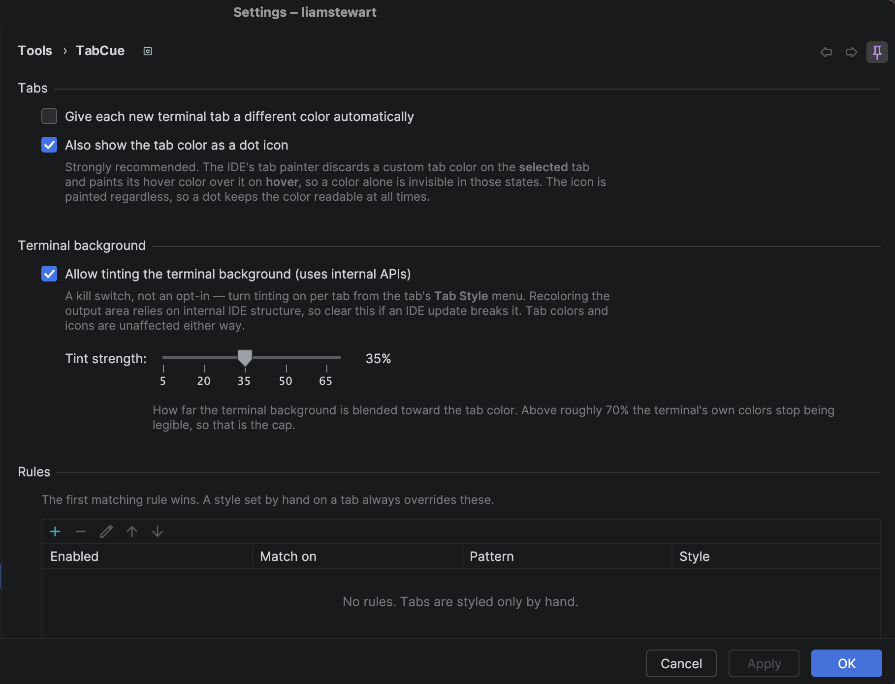

# TabCue: Visual Terminal Tabs

Give every terminal tab its own colour, emoji, icon and text colour, so five open terminals stop
looking like one terminal.

<p align="center">
  
</p>

I kept losing track of which terminal was which. `npm run dev`, a couple of Claude sessions, and
an `ssh` into something I'd rather not typo in. They all look identical, and the IDE numbers them
"Local (2)", "Local (3)" and leaves you to remember the rest.

The selected tab above keeps its dot after the IDE has discarded its background colour, and the
output area is tinted to match.

## What it does

- **Colours.** Eight presets, or *Custom…* for the IDE's full colour picker (hex, RGB,
  eyedropper). Shown as the tab background *and* a small dot.
- **Text colour.** White, black or custom. Worth knowing: the IDE throws away a tab's colour
  while that tab is selected, so the label is the one cue that survives. This is how you keep a
  tab identifiable when you're actually looking at it.
- **Icons and emoji.** A built-in icon or any emoji, picked from the tab menu.
- **Rules.** Style tabs automatically by title or working directory. Give every `Claude Code` tab
  the same emoji, or paint anything matching `ssh prod` red.
- **Background tint.** Optionally tint the terminal output area too, not just the tab.

It works before you configure anything. Every terminal gets its own colour, derived from the tab's
name and directory rather than handed out in the order tabs open, so it's the same colour tomorrow.
No rules are invented for you. Turn it off under *Tools ▸ TabCue* if you'd rather pick every colour
by hand.

Right-click any Terminal tab → **Tab Style**. Settings live under *Tools ▸ TabCue*.

<table>
<tr>
<td width="50%"></td>
<td width="50%"></td>
</tr>
<tr>
<td>Everything is on the tab's own context menu, under <b>Tab Style</b>.</td>
<td>Eight presets, or any colour at all from the IDE's own picker.</td>
</tr>
<tr>
<td width="50%"></td>
<td width="50%"></td>
</tr>
<tr>
<td>Twelve emoji are one click; <i>Custom…</i> takes anything else.</td>
<td>Rules, auto colours and tint strength live in <i>Settings ▸ Tools ▸ TabCue</i>.</td>
</tr>
</table>

## Install

Search for **TabCue** in *Settings ▸ Plugins*. Or build it yourself (see below) and use
*Install Plugin from Disk* on the zip.

Works in any IntelliJ-based IDE that bundles the Terminal (IDEA, PhpStorm, WebStorm, PyCharm,
GoLand, RubyMine and the rest) on 2025.3 or newer, with both the new and classic terminal engines.

## Good to know

A few things that look like bugs but are the platform:

- **The tab colour disappears on the selected tab and on hover.** The IDE's tab painter overpaints
  it and there's no per-tab override. That's why there's also a colour dot. It survives every
  state, and so does the background tint.
- **Split terminals share one colour.** A split is several sessions inside one tab, and the colour
  belongs to the tab.
- **Emoji picking is macOS-only.** The button opens the system Emoji & Symbols palette. Elsewhere,
  paste one in and it still works.
- **Terminal ANSI colours stay global.** Only the tab and the background are per-tab; the palette
  itself is `Settings ▸ Editor ▸ Color Scheme ▸ Console Colors`.

Rules are stored in `.idea/terminalTabStyle.xml` so you can commit and share them. Per-tab styles
go in `workspace.xml` instead, because their keys contain working directories and shell-reported
titles which don't belong in a shared file. Nothing leaves your machine.

## Building

```bash
./build.sh buildPlugin     # → build/distributions/tabcue-1.0.0.zip
./build.sh runIde          # sandbox IDE with the plugin loaded
./build.sh check           # tests
```

The build provisions its own JDK 21, so there's nothing to install first.

Compiled against the 2025.3 SDK (platform branch `253`). That's the baseline, not a ceiling.
`since-build` is `253` with no upper bound. Compiling against the oldest supported branch is
deliberate: it's what makes the compiler reject anything missing from 2025.3, rather than finding
out later.

1.0.0 passes the JetBrains Plugin Verifier against all five, with 102 tests green and no compiler
warnings:

| IDE | Build |
| --- | --- |
| PhpStorm 2026.2.2 | `PS-262.10315.130` |
| PhpStorm 2025.3.6.1 | `PS-253.33813.65` |
| IntelliJ IDEA 2025.3 | `IU-253.28294.334` |
| WebStorm 2025.3 | `WS-253.28294.332` |
| PyCharm 2025.3 | `PY-253.28294.336` |

```bash
./build.sh verifyPlugin
```

## Licence

MIT. See [LICENSE](LICENSE).
